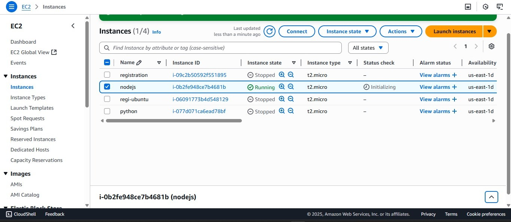

# Node.js Application Deployment Using EC2 and Nginx on AWS

### This project demonstrates deploying a Node.js web application hosted on a cloud-based AWS EC2 instance, with Nginx acting as a reverse proxy, ensuring high performance and security. The primary goal is to build, deploy, and serve a Node.js server on EC2, making it accessible via a domain or public IP.

### Project Objectives
* Launch an EC2 Instance and configure security.
* Install Node.js and dependencies.
* Deploy the Node.js application.
* Configure Nginx as a reverse proxy for the Node.js server.

##  Tech Stack
**Node.js** (Backend runtime)
- **Express.js** (Web framework)
- **PM2** (Background process manager)
- **Nginx** (Reverse proxy)
- **Amazon Linux / CentOS**
##  Live Preview

Once deployed, you can access the app via:

- `http://<your-server-ip>:3000` → Node app directly  
- `http://<your-server-ip>/` → Nginx reverse-proxy

## 1 :  Setup Instructions

### step 1 : Launch an AWS EC2 Instance
* In the AWS Management Console, in the search bar at the top, enter EC2 and select EC2 under services.
* In the left menu, click on Launch Instances.
* Choose:
* * AMI: Amazon Linux 2 (recommended)

* * Instance type: t2.micro (free tier eligible)

* * Key pair: Create new or use existing
* * Security Group: Allow HTTP (port 80) , SSH (port 22) and allow custom TCP (port 3000) for Node app

* Click Launch to create the instance.

### step 2 : Install Node.js and npm

bash
* sudo yum install nodejs -y
* sudo yum install npm -y

### step 3 : Set Up the Project
bash
* mkdir nodeapp
* cd nodeapp

## 2 : Create package.json file
bash
 * <a href="./package.json">  Vim package.json </a>

 ## Create app.js file
 bash
 * <a href="./app.js"> app.js </a>

 ## 3 : Install Dependencies
 bash
 * npm install

## 4 : Start the App
bash
*  systemctl npm start
 
*  Open browser: http://<your-server-ip>:3000

## 5 :  Run App in Background with PM2
bash
*  sudo npm install -g pm2
*   pm2 start app.js

## 6 :  Install and Start Nginx
bash
*  sudo yum install nginx -y
*  sudo systemctl start nginx   
*  sudo systemctl enable nginx
*  sudo systemctl status nginx
## 7 :  Configure Nginx Reverse Proxy
bash
*  sudo vim /etc/nginx/nginx.conf
* add the server block inside nginx.con 
* <a href="./nginx.conf"> nginx.conf </a>

## 8 : Restart Nginx
bash
*  sudo systemctl restart nginx

## 9 :  Test the App
bash
*  Final Output
*  Visit: http:// your-ec2-ip

You should see:

 Hello this is nodejs application running on Docker Container!
 

